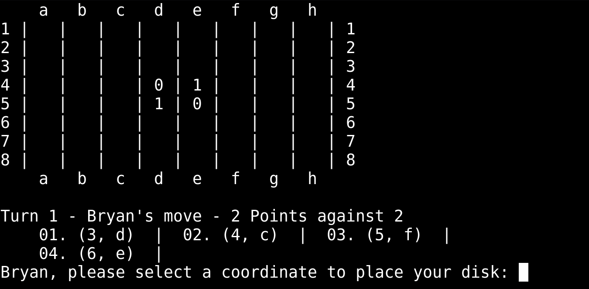
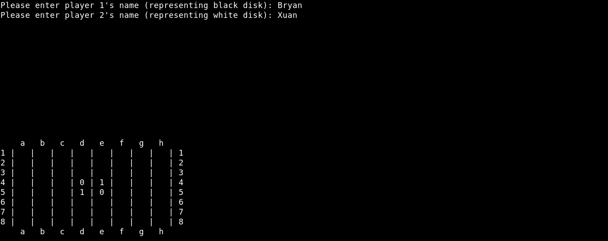
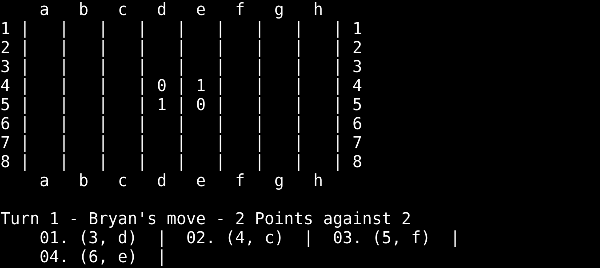
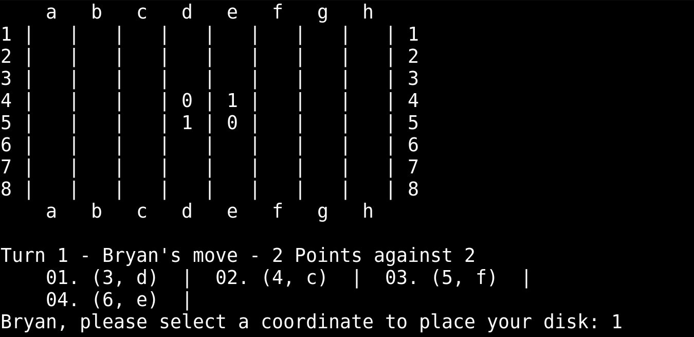
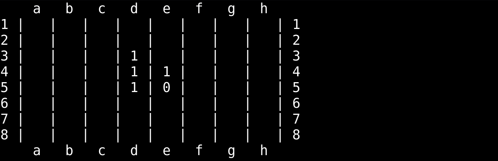
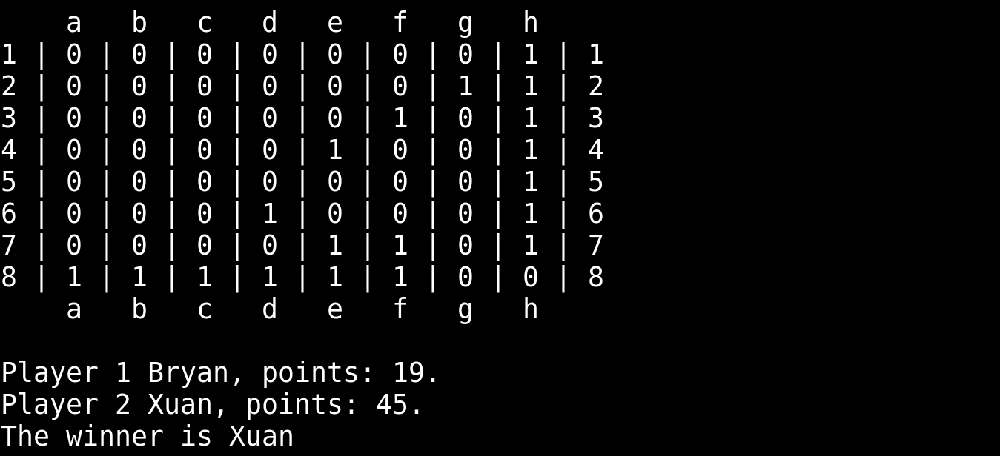

# Reversi

Reversi, a strategy board game for 2 players, played on an 8x8 uncheckered board. One player represents black discs, the other white discs. Players take turns placing discs on the board, with the objective to have the majority of discs turned to display their colors until the last playable empty square is filled.

&nbsp;
## Characteristics
- Linked List was used to store the set of coordinates that each player can place their discs.

&nbsp;
## Task - Implement the game logic

### A.1 Start Condition - Gather player inputs and implement the board with the starting positions.

&nbsp;
### A.2 Managing turns - Player that represents the black disc starts the game.
#### A.2.1 Computing positions where the player can move.

&nbsp;
#### A.2.2 Asking the player where s/he wants to move

&nbsp;
#### A.2.3 Discs placement

&nbsp;
### A.3 Printing Final Results

